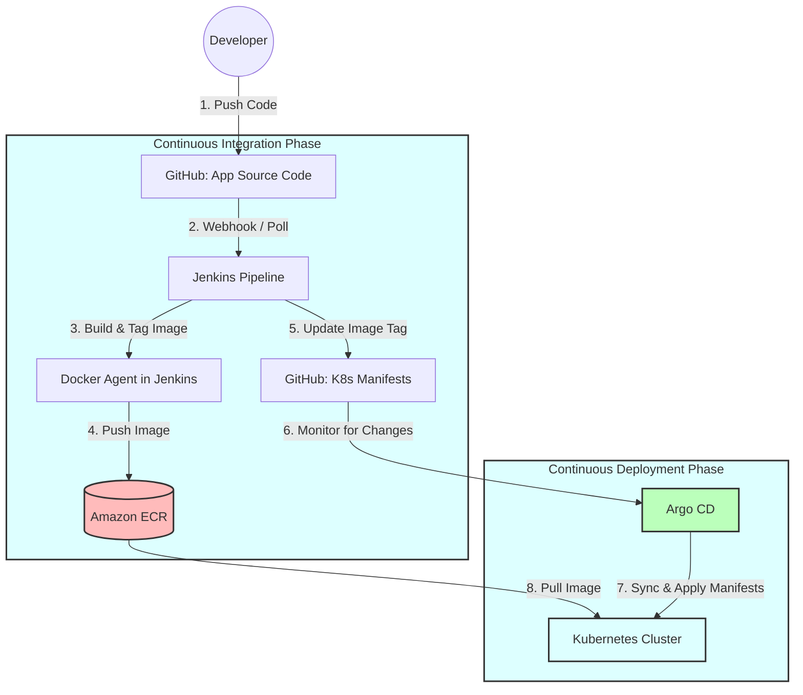

# End-to-End CI/CD Pipeline for StreamingApp

This document outlines the architecture and installation steps required to set up a complete CI/CD pipeline for the StreamingApp using GitHub, Jenkins, Docker, Amazon ECR, and Argo CD.

## Prerequisites

Before setting up the CI/CD pipeline, ensure you have the following tools and accounts configured on your local machine. If you are missing any of these tools, refer to the [Tools Installation Guide](#tools-installation-guide-macos) below.

*   **Docker Desktop**: Required to run Jenkins locally and to provide a local Kubernetes cluster for Argo CD.
*   **Kubernetes (enabled via Docker Desktop)**: The local cluster where Argo CD and eventually your application will reside.
*   **AWS Account**: An active AWS account with an IAM user that has access to Amazon ECR.
*   **AWS CLI**: Required to authenticate Docker with Amazon ECR.
*   **Git CLI**: For version control and pushing manifests to GitHub.
*   **GitHub Account**: For hosting the source code and the Kubernetes manifests.

## CI/CD Architecture Flow

The following diagram illustrates the GitOps methodology used for continuous integration and continuous deployment.



### Architecture Explanation

**Continuous Integration (CI):**
1. **Push Code:** A developer commits and pushes code to the application's source code repository on GitHub.
2. **Trigger Jenkins:** Jenkins detects the change (via Webhook or polling) and triggers the CI pipeline.
3. **Build Image:** Jenkins runs a build using a Docker agent (`docker:dind`). It compiles the code and builds a new Docker image labeled with an incremental build ID (e.g., `v1.0.42`).
4. **Push to Registry:** Jenkins authenticates with AWS and pushes the new Docker image to Amazon Elastic Container Registry (ECR).
5. **Update Manifests:** Jenkins clones a repository containing the Kubernetes YAML manifests, updates the `deployment.yaml` with the new customized image tag (`v1.0.42`), and pushes the commit back to GitHub.

**Continuous Deployment (CD):**
6. **Monitor for Changes:** Argo CD, running inside the Kubernetes cluster, continuously polls the Manifest GitHub repository.
7. **Sync Manifests:** Upon detecting the new commit from Jenkins, Argo CD sees a drift between the cluster's current state and the Git repository's desired state. It automatically applies the new YAML manifests to the cluster.
8. **Pull & Deploy:** The Kubernetes cluster pulls the new `v1.0.42` image from Amazon ECR and rolls out the updated application pods.

---

## Tools Installation Guide (macOS)

The following steps cover setting up the entire toolchain locally on your MacBook for testing and development.

### 1. Docker Desktop & Local Kubernetes

Docker Desktop provides both the container runtime and a local Kubernetes cluster.

**Installation:**
1. Download Docker Desktop for Mac from the [official website](https://www.docker.com/products/docker-desktop/).
2. Install the `.dmg` file and launch Docker Desktop.
3. Go to **Settings** (Gear icon) -> **Kubernetes**.
4. Check **Enable Kubernetes** and click **Apply & Restart**.
5. Once restarted, verify the installation in your terminal:
   ```bash
   kubectl get nodes
   ```
   *(You should see a node named `docker-desktop` with status `Ready`)*

### 2. Jenkins (Running locally via Docker)

Running Jenkins locally via Docker is the cleanest way to set it up without cluttering your Mac.

**Installation:**
1. Run the official Jenkins Docker image with the Docker socket mounted (so Jenkins can build images):
   ```bash
   docker run -d -p 8080:8080 -p 50000:50000 \
     -v jenkins_home:/var/jenkins_home \
     -v /var/run/docker.sock:/var/run/docker.sock \
     --name jenkins \
     jenkins/jenkins:lts
   ```
2. Retrieve the initial admin password:
   ```bash
   docker exec jenkins cat /var/jenkins_home/secrets/initialAdminPassword
   ```
3. Open a browser and go to `http://localhost:8080`.
4. Paste the password, install suggested plugins, and create your admin user.
5. In Jenkins, install the **Docker Pipeline**, **Amazon ECR**, and **Git** plugins via `Manage Jenkins` -> `Plugins`.

### 3. Argo CD (Running in local Kubernetes)

Argo CD handles the deployment side of GitOps.

**Installation:**
1. Create a namespace and apply the official installation manifest:
   ```bash
   kubectl create namespace argocd
   kubectl apply -n argocd -f https://raw.githubusercontent.com/argoproj/argo-cd/stable/manifests/install.yaml
   ```
2. Wait for all pods to be running:
   ```bash
   kubectl get pods -n argocd -w
   ```
3. Retrieve the Argo CD admin password:
   ```bash
   kubectl -n argocd get secret argocd-initial-admin-secret -o jsonpath="{.data.password}" | base64 -d; echo
   ```
4. Access the UI by port-forwarding:
   ```bash
   # Note: Since Jenkins is using port 8080, we will port-forward Argo CD to 8443
   kubectl port-forward svc/argocd-server -n argocd 8443:443
   ```
5. Open a browser and go to `https://localhost:8443`. Log in with username `admin` and the password you retrieved.

### 4. AWS CLI (For Amazon ECR Authentication)

Useful for testing ECR access from your local machine.

**Installation:**
1. Install via Homebrew:
   ```bash
   brew install awscli
   ```
2. Configure your credentials (you will need an IAM user with ECR permissions):
   ```bash
   aws configure
   ```
   *(Enter your Access Key, Secret Key, and default region like `us-east-1`)*

### 5. Git CLI

Used for version control. macOS usually comes with it, but you can update via Homebrew.

**Installation:**
1. Install/Update via Homebrew:
   ```bash
   brew install git
   ```
2. Configure your identity:
   ```bash
   git config --global user.name "Your Name"
   git config --global user.email "your.email@example.com"
   ```

---
**Official Documentation Reference:**
- [Docker Desktop for Mac](https://docs.docker.com/desktop/mac/install/)
- [Kubernetes](https://kubernetes.io/docs/home/)
- [Jenkins Documentation](https://www.jenkins.io/doc/)
- [Argo CD Official Docs](https://argo-cd.readthedocs.io/en/stable/)
- [Amazon ECR Docs](https://docs.aws.amazon.com/ecr/)
