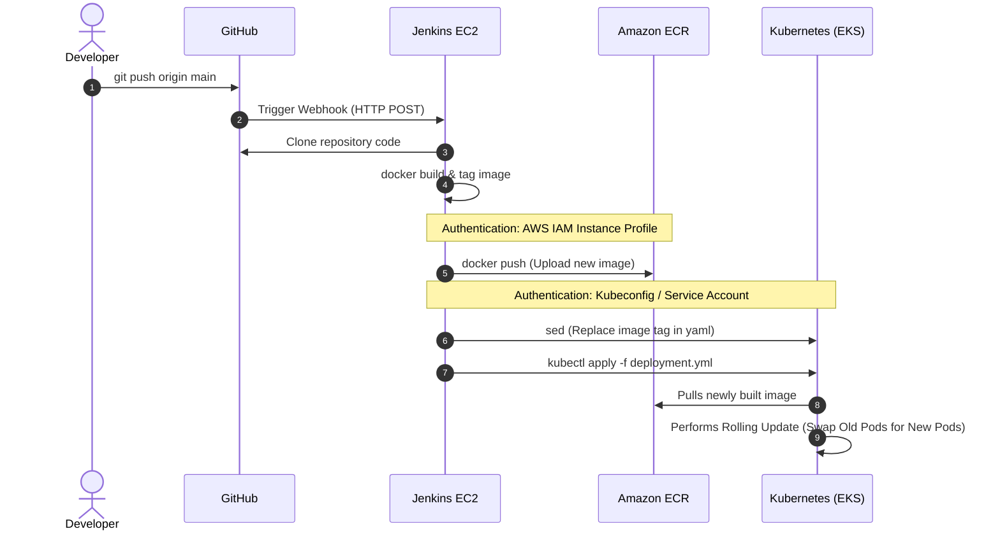

# 🚢 End-to-End Modern CI/CD Architecture Flow

This document details the complete Continuous Integration and Continuous Deployment (CI/CD) lifecycle of deploying microservices (e.g., `auth-service`) from a developer's local machine all the way to a production Amazon Kubernetes cluster (EKS) with **zero-downtime**.

The core technologies driving this flow are **GitHub** (Source Control), **Jenkins** (Automation Server), **Docker** (Containerization), **Amazon ECR** (Image Registry), and **Kubernetes** (Orchestration).

---

## 🗺️ High-Level Architecture Flow

This sequence diagram illustrates exactly what happens the moment a developer pushes new code.



---

## 🛠️ Phase-by-Phase Breakdown

### Phase 1: Source Control & Trigger (GitHub)
**The Goal:** Automatically listen for code updates.

* **What Happens:** When a developer pushes a new feature to the `main` branch, GitHub immediately fires an HTTP POST payload (a Webhook) to the public IP/Domain of your Jenkins server.
* **Commands / Code (Developer):**
  ```bash
  git add .
  git commit -m "feat: added new auth endpoint"
  git push origin main
  ```
* **Required Access / Setup:**
  * **GitHub Webhook:** Configured in repository settings (e.g., `http://your-jenkins-ip:8080/github-webhook/`).
  * **Jenkins:** The "GitHub Integration Plugin" must be installed and configured on the Jenkins Server.

---

### Phase 2: Continuous Integration (Jenkins Build Workspace)
**The Goal:** Receive the code, test it, and build it into a portable, runnable Docker container.

* **What Happens:** Jenkins wakes up upon receiving the Webhook. It looks at the project's `Jenkinsfile`, checks out the new code, and runs the `docker build` command. It dynamically tags the image with the specific Jenkins Build Number (e.g., `BUILD_ID=42`) rather than `:latest` to ensure every release is uniquely traceable.
* **Jenkinsfile Snippet (Pipeline Code):**
  ```groovy
  stage('Build Docker Image') {
      steps {
          script {
              // Creating a unique tag using Jenkins built-in env.BUILD_ID
              def IMAGE_TAG = "streamingapp/auth-service:build-${env.BUILD_ID}"
              sh "docker build -t ${IMAGE_TAG} ."
          }
      }
  }
  ```
* **Required Access / Setup:**
  * **Jenkins Server:** Must have Docker installed and the `jenkins` user added to the `docker` group.
  * **GitHub Credentials:** Jenkins needs SSH keys or a Personal Access Token to safely clone private repositories.

---

### Phase 3: The Artifact Repository (Amazon ECR)
**The Goal:** Upload the newly built, unique Docker image to a private, secure cloud vault.

* **What Happens:** Jenkins authenticates directly with Amazon Web Services. It re-tags the image to include the AWS routing URL, and pushes the image layers upward to Elastic Container Registry.
* **Jenkinsfile Snippet (Pipeline Code):**
  ```groovy
  stage('Push to ECR') {
      steps {
          script {
              def AWS_ACCOUNT = "975050024946"
              def REGION = "ap-south-1"
              def ECR_URL = "${AWS_ACCOUNT}.dkr.ecr.${REGION}.amazonaws.com"
              def LOCAL_TAG = "streamingapp/auth-service:build-${env.BUILD_ID}"
              def AWS_TAG = "${ECR_URL}/streamingapp/auth-service:build-${env.BUILD_ID}"

              // 1. Authenticate Docker with AWS
              sh "aws ecr get-login-password --region ${REGION} | docker login --username AWS --password-stdin ${ECR_URL}"
              
              // 2. Add the AWS tracking tag
              sh "docker tag ${LOCAL_TAG} ${AWS_TAG}"
              
              // 3. Upload to the cloud
              sh "docker push ${AWS_TAG}"
          }
      }
  }
  ```
* **Required Access / Setup:**
  * **AWS IAM Role:** This is critical for security. You do NOT want to store hardcoded AWS keys (`AWS_ACCESS_KEY_ID`) inside Jenkins. Instead, attach an **IAM Instance Profile** (AmazonEC2ContainerRegistryPowerUser) directly to the Jenkins EC2 instance. Jenkins will automatically inherit these permissions seamlessly.

---

### Phase 4: Continuous Deployment (Kubernetes EKS)
**The Goal:** Tell the production Kubernetes cluster that a new update is ready, and cleanly swap the users over to the new version.

* **What Happens:** Jenkins must tell Kubernetes to pull the new `build-42` image. It opens the raw Kubernetes YAML file (e.g., `auth-deployment-service.yml`), searches for the old `image:` string, replaces it with the new ECR URL, and executes `kubectl apply`. Kubernetes then orchestrates a "Rolling Update"—spinning up the new pods and shutting down the old pods only when the new ones report `1/1 READY`.
* **Jenkinsfile Snippet (Pipeline Code):**
  ```groovy
  stage('Deploy to Kubernetes') {
      steps {
          script {
              def AWS_TAG = "975050024946.dkr.ecr.ap-south-1.amazonaws.com/streamingapp/auth-service:build-${env.BUILD_ID}"
              
              // 1. Swap the placeholder image name in the YAML with the new explicit AWS string.
              // We use "sed" (Stream Editor), a classic Linux string replacement utility.
              sh "sed -i 's|IMAGE_PLACEHOLDER|${AWS_TAG}|g' k8s/auth-deployment-service.yml"
              
              // 2. Tell Kubernetes to apply the updated configuration
              sh "kubectl apply -f k8s/auth-deployment-service.yml"
          }
      }
  }
  ```
* **Required Access / Setup:**
  * **Kubeconfig:** The Jenkins server needs a `.kube/config` file to know the IP address of the EKS Master Node.
  * **AWS EKS Authentication:** Jenkins needs the `aws-iam-authenticator` installed. Its IAM role must be mapped inside the EKS cluster's `aws-auth` ConfigMap so Kubernetes trusts Jenkins as a valid administrator.

---

### 🎉 The Final Result
Within approximately 60 seconds of a developer pushing code to GitHub, the new feature is cleanly deployed, thoroughly tested, securely stored in AWS, and running live in the Kubernetes cluster with **zero human intervention, and zero application downtime.**
